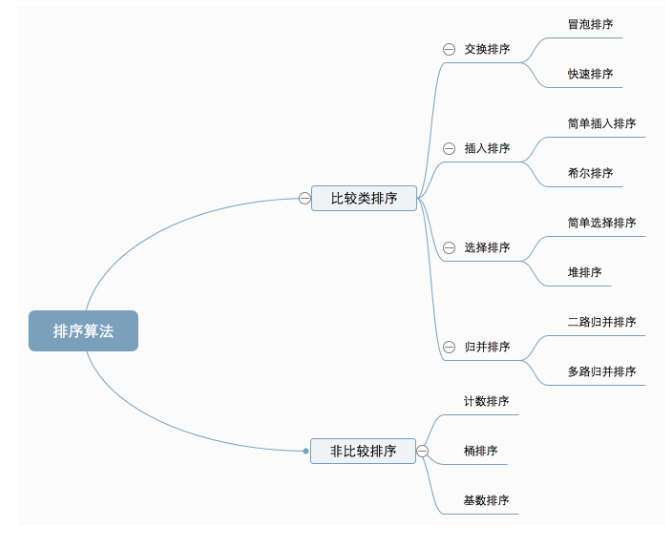
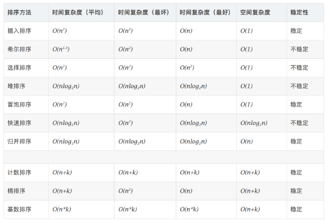

### 分类

* 比较类排序（非线性时间比较类排序）：通过比较来决定元素间的相对次序，由于其时间复杂度不能突破O(nlogn)，因此也称为非线性时间比较类排序。
* 非比较类排序（线性时间非比较类排序）：不通过比较来决定元素间的相对次序，它可以突破基于比较排序的时间下限，以线性时间运行，因此也称为线性时间非比较类排序。

* * *
### 算法复杂度

- 稳定：如果a原本在b前面，且a=b，排序后a仍然在b前面。
- 不稳定：如果a原本在b前面，且a=b，排序后a可能出现在b后面。

* * *